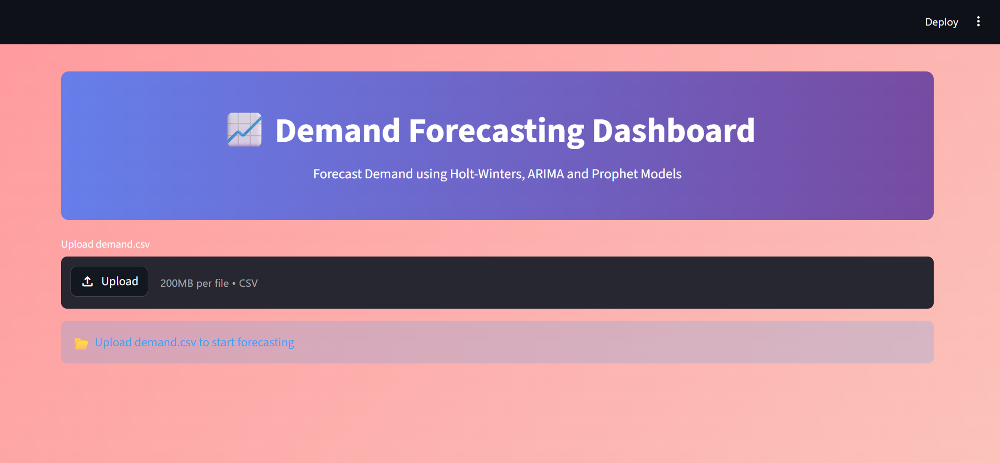
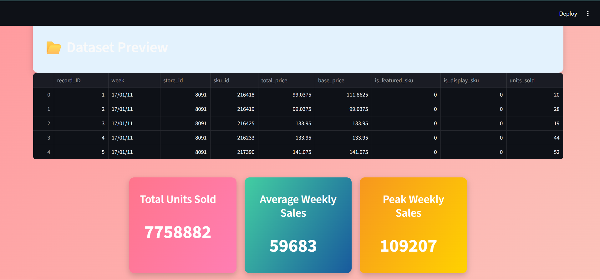
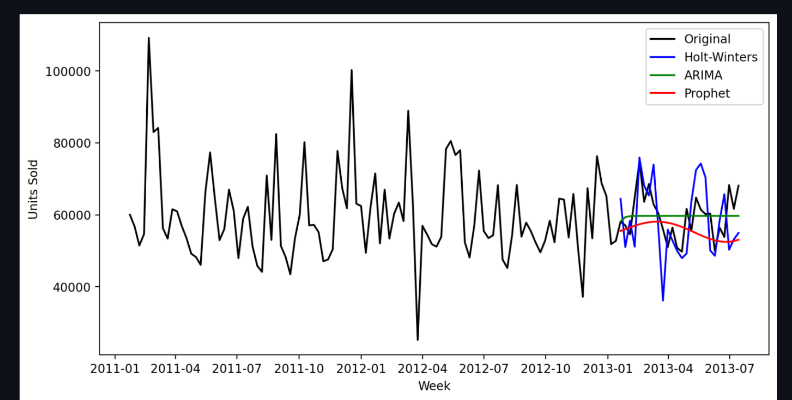

# Demand Forecasting Streamlit App

## Brief Description

This project is a Streamlit-based demand forecasting dashboard. It allows users to upload a CSV dataset containing weekly demand data and compares multiple time-series forecasting models to identify the best-performing model based on RMSE.

The application supports demand trend visualization, KPI analysis, model comparison, and forecast plotting using Holt-Winters, ARIMA, and Prophet models.

## Technology Stack and Tools Used

- Python
- Streamlit
- Pandas
- Matplotlib
- Statsmodels
- Scikit-learn
- Prophet
- Git and GitHub

## Features and Functionalities Implemented

- Upload demand dataset in CSV format
- Display dataset preview
- Convert weekly date data into time-series format
- Resample and summarize weekly sales data
- Show KPI metrics:
  - Total units sold
  - Average weekly sales
  - Peak weekly sales
- Visualize weekly sales trend
- Train and compare forecasting models:
  - Holt-Winters Exponential Smoothing
  - ARIMA
  - Prophet
- Calculate RMSE for each model
- Identify the best forecasting model
- Display forecast comparison graph

## Dataset Format

The uploaded CSV file should contain the following columns:

```text
week,units_sold
```

Example:

```csv
week,units_sold
01/01/24,120
08/01/24,135
15/01/24,128
```

The `week` column should use the `dd/mm/yy` date format.

## Installation and Execution Steps

### 1. Clone the Repository

```powershell
git clone https://github.com/YOUR_USERNAME/streamlit-demand-forecasting.git
cd streamlit-demand-forecasting
```

### 2. Install Dependencies

```powershell
pip install -r requirements.txt
```

### 3. Run the Application

```powershell
python -m streamlit run app.py
```

### 4. Open the App

After running the command, open the local URL shown in the terminal:


http://localhost:8501


### 5. Upload Dataset

Upload a `demand.csv` file with the required columns and view the forecasting dashboard.

## Project Structure

streamlit-demand-forecasting/
├── app.py
├── requirements.txt
├── README.md
├── PROJECT_REPORT.md
└── screenshot-output/
    ├── dashboard.png
    ├── forecast-graph.png
    └── model-output.png


## Team Members

- Mihir Dave
- Mehul Jain

Update this section with the final names, roll numbers, and responsibilities of all team members.

## Project Screenshots / Output

Add screenshots and output images of the running application inside the `screenshot-output/` folder and link them below.

Example:

```markdown



```

## Output

The app displays:

- Dataset preview
- Weekly sales trend chart
- KPI cards
- Model RMSE comparison table
- Best model result
- Forecast comparison graph

## Future Enhancements

- Add support for more dataset formats
- Add downloadable forecast results
- Add interactive Plotly charts
- Add model parameter customization
- Deploy the app on Streamlit Community Cloud
